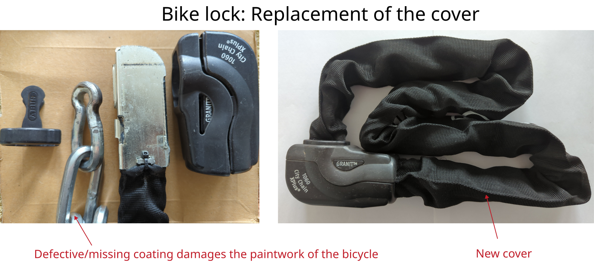

# ABUS chain lock cover replacement

Manufacturer: ABUS     
Type: `City Chain XPlus 1060`    

## Description of failure
The casing of the lock is defective, causing the exposed chain links to damage the paintwork of the bicycle.

## Cover replacement
The old sheathing can be removed quite easily: 
First, both ends of the lock must be opened. 
The plastic can be easily levered off in both cases. 
A flat-head screwdriver is required for this.

The new sheathing can then be installed: 
It is secured on one side with cable ties. 
To attach the new sheathing, 
two small holes must be made in it.
There are also universal covers available if no replacement part is available from the manufacturer.