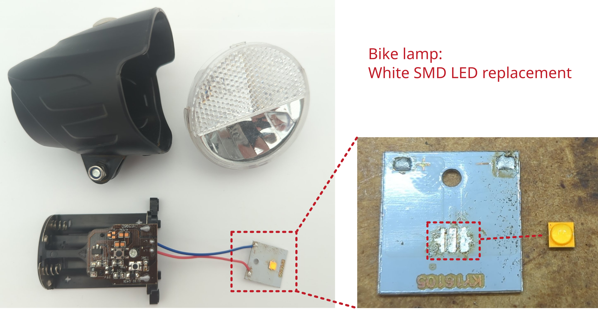

# LED bike lamp

## Description of failure
Does not turn on.

## Failure investigation
First check the batteries and the battery contacts and insert new batteries if necessary. The voltage across the LED is then measured to see whether the electronics are working. In this case, there is voltage across the LED, but it does not light up. The LED is therefore defective and must be replaced. 

As can be seen in the illustration, the LED is soldered to a cooling plate. Due to the cooling plate, desoldering the LED is somewhat more difficult, but can usually be done with a normal soldering iron. However, the soldering and desoldering process is somewhat easier with a heating plate.

Mouser order number: `941-XPGEWT020000HL7E`