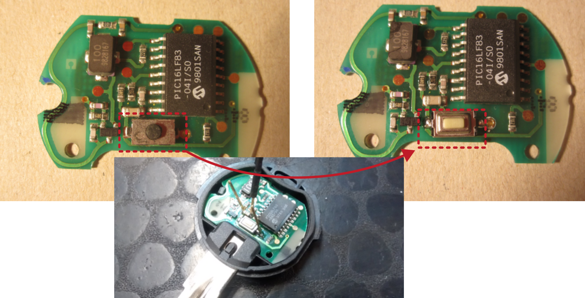

# Smart radio remote control

Manufacturer: `smart`

## Description of failure
The door of the car does not unlock using the radio remote control.

## Failure investigation
Measuring the push button itself shows non-working contacts. The switch is replaced and the car unlocks very well again.

When replacing the push-button, make sure that the pin spacing is the same as the old push-button. The height of the push-button must also be taken into account. This must be identical so that it fits properly into the housing and the push-button can then be activated easily.