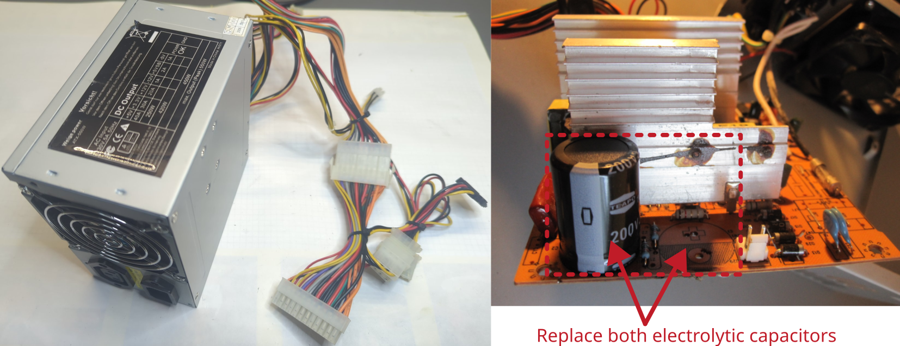

# Computer switched mode power supply unit

Manufacturer: `Weige Power`    
Type: `ATX-550 W`

## Description of failure
The PC switches off during operation. It smells like electrolyte. The PC also no longer starts. 

## Failure investigation
Obviously a capacitor has burst. The electrolyte had partially spread over the circuit board (unfortunately not visible in the picture, as this was only taken after cleaning). When replacing the capacitor, it is important to also replace the other one, as otherwise it is likely that the other one will break soon. 

After replacing the capacitor, the PC works perfectly again.

Original capacitor: `330 µF`, `200 V`, `105 °C`, `RM10`, diameter x height: `22x35 mm`