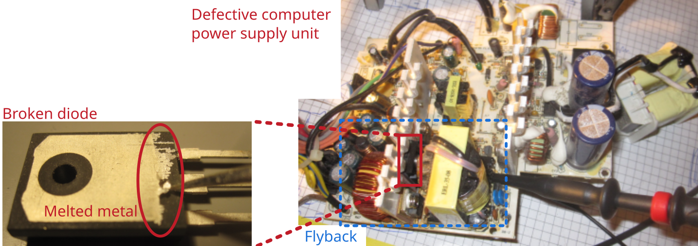

# Computer switched mode power supply unit 2

## Description of failure
The PC power supply unit no longer switches on.

## Failure investigation
The fan bracket on this power supply unit is broken, which has subsequently blocked the fan. This has caused the power supply unit to overheat.

When troubleshooting, it is important to simulate starting the PC by short-circuiting the corresponding power supply pin to ground. The power supply unit then starts to supply voltage at the output. However, the output voltage of the power supply unit is still not present.

During the standard check of the flyback, the diodes and switches were checked (see also ). It was determined that the diode is defective. When removing the semiconductor, you can clearly see that the component has become so hot that even the metal on the back has melted.

After replacing the semiconductor (don't forget the thermal gap pad!), the PC power supply works again.

Diode: `MBR3060PT`     
Conrad order number: `2994770 - 62`