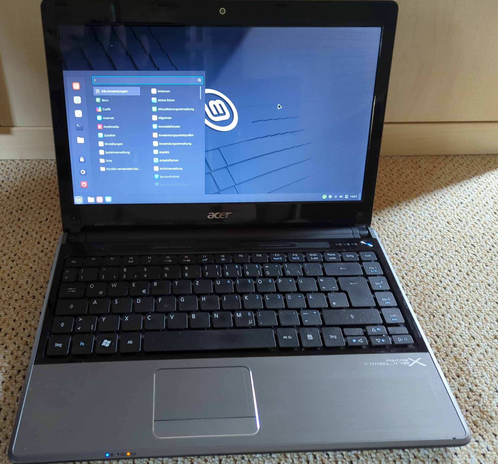

# Computers and electronic waste
New versions of operating systems are released at regular intervals, with new functions and new security updates. This is generally very welcome, if it weren't for the ever-increasing hardware requirements. A computer magazine has quantified the number of computers that will become obsolete in roughly one year simply because the new operating system has excessively high system requirements. Replacing these systems, means about `240.000.000` [1] computers will be electronic waste. Let's assume `1.5 kg` per device (notebooks), this means `360.000.000 kg` of electronic waste. Some online magazines calculate with `480.000.000 kg` of electronic waste [2, 3].

 * [[1] golem.de](https://www.golem.de/news/windows-10-support-endet-etwa-240-millionen-pcs-koennten-ab-2025-im-muell-landen-2312-180599.html)
 * [[2] pcgameshardware.de](https://www.pcgameshardware.de/Windows-10-Software-259581/News/Supportende-480-Millionen-Kilogramm-Elektroschrott-1436963/)
 * [[3] computerbase.de](https://www.computerbase.de/2023-12/support-ende-millionen-von-windows-10-pcs-koennten-bald-im-muell-landen/)

## Using a lightweight system, Linux.
There are a huge number of Linux systems. Most of them are open-source software and can be used free of charge. Furthermore, the general public has come to believe that Linux is difficult to use and therefore only for nerds. This is true for some special Linux distributions, but is by no means true for all distributions.

There is Linux Mint, for example. This focuses on ease of use and is therefore very user-friendly. The system is easy to maintain and offers a great user experience. 

 * [Linux Mint official homepage](https://www.linuxmint.com/)
 * [Wikipedia](https://en.wikipedia.org/wiki/Linux_Mint)
 
Another very popular distribution is Ubuntu, which is also very user-friendly. 

 * [Ubuntu official homepage](https://ubuntu.com/download/desktop)
 * [Wikipedia](https://en.wikipedia.org/wiki/Ubuntu)

In general, it is advisable to use the long-term support (LTS) versions, as these have a significantly longer maintenance period without having to reinstall the system in the meantime. 

To get an impression of how to install and use your Linux distribution, it is recommended to search for it on youtube. Here you will generally find very good and detailed instructions on these topics, e.g. [this video for Linux Mint](https://www.youtube.com/watch?v=DDtMTVW1U4s).

## Linux programs
As soon as the switch to Linux has been made, the question arises as to which programs can be used for what. Below you will find an overview. Many of these programs are also available for other operating systems.

 * Browser: `Firefox`, `Chromium`
 * Mail: `Thunderbird`, `Evolution`
 * Notes: `cherrytree`
 * Office: `LibreOffice`
 * Music/Video: `VLC`
 * Password manager: `KeepassXC`
 * Graphic editing: `GIMP`
 * Drawing program: `Inkscape`

## Possible conversion strategy towards a Linux operating system
To avoid switching to a new operating system and new programs all at once (too many new things at once), it is advisable to carry out the changeover in stages. In the first step, it makes sense to install the Linux programs under your current operating system to familiarize yourself with them. Many of the programs listed, such as `Firefox, Thunderbird, LibreOffice, KeepassXC, VLC and many more`, are also available for other operating systems, too. Once the user is familiar with these programs, the operating system can be changed after a few months. This way, there is not too much new information at once and you can gradually get used to the new software.

## When it doesn't make sense to switch to Linux
Linux is not the miracle tool. There a various reasons not to switch to a Linux operating system:

 * In the games industry, there is now better and better support for Steam under Linux. However, the support for many games is not as extensive as under other operating systems. Check this before on the internet.
 * If you use software that is not available for Linux. And for which there is no alternative. A search on the Internet helps to find good alternative software in many cases, but not always.