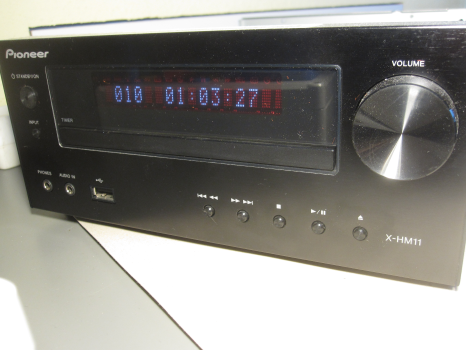
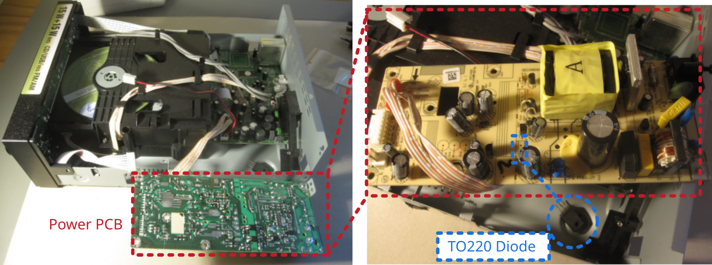

# CD-player Pioneer X-HM11-K does not turn-on

## Description of failure
The device does not start.

## Troubleshooting

The secondary flyback rectifier diode is broken.

Broken diode: MBRF20200CT
