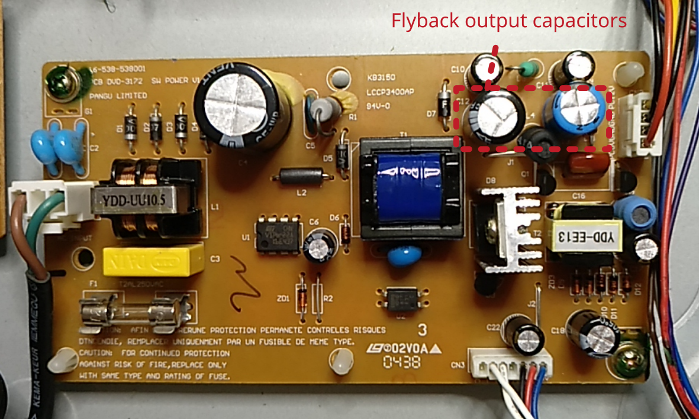
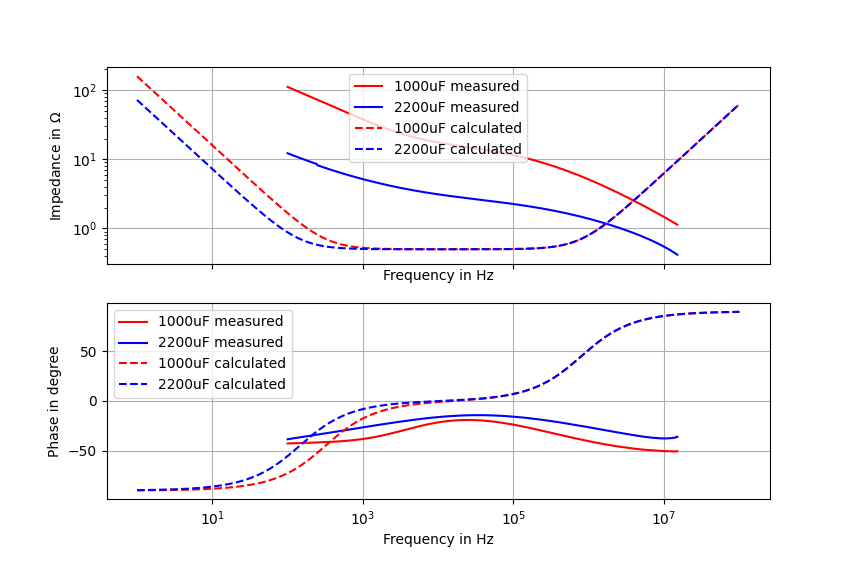

# DVD player CyberHome does not work at all

Cyberhome CH-DVD 452

## Description of failure
The device does not work at all. Display stays empty.

## Troubleshooting

When measuring the output voltage of the power PCB, this voltage is not stable. An investigation into the electrolytic capacitors shows a bad impedance behavior. Replacing the capacitors solves the issue. Check out the [capacitor section](../../tutorials/capacitors/readme.md) for more details about broken capacitors.

## Investigation in the electrolytic capacitors
Both broken capacitors, the `1000 µF` and the `2200 µF` device are analyzed by an impedance analyzator (full line `red` and `blue`). The dash-doted lines shows the calculated waveform of healty capacitors.

## More helpful information for this repair
 * [capacitor section](../../tutorials/capacitors/readme.md)