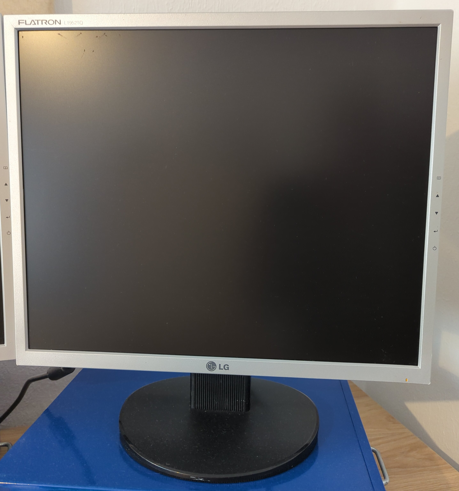
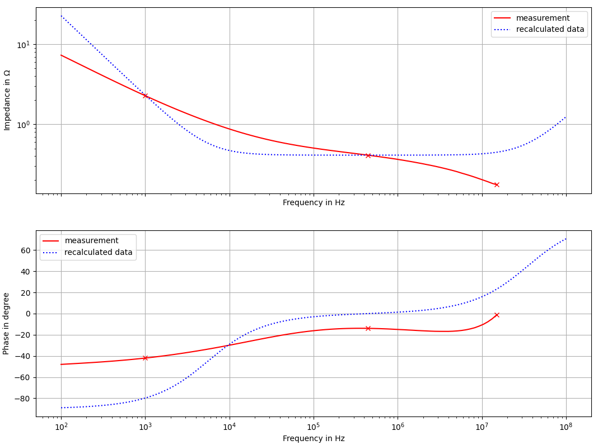

# LG Flatron L1952

## Description of failure
Especially failures with the background lightning:
 * Background lightning turns off randomly
 * flashing background lightning
 * general display errors (stripes, ...)     

The same error was observed on the following models: L1952T, L1952S, L1952TQ

## Troubleshooting

The main problem is in broken electrolytic capacitors, what is a common problem in power electronics supplies. A electrolytic capacitor comes with a certain operating hours at a given ripple current. If the designers made any calculation mistake in calculating the lifetime (this is very difficult!), the devices goes broken earlyier than expected. On the other hand, most of the devices will fail after they reached the end of the capacitors lifetime. Replacing these capacitors is cheap and easy. 
 * Disassemble the housing carefully
 * Inside, there are two PCBs: a power PCB and a main PCB (often named as T-Con board)
 * The main reason for background lightning errors are broken capacitors of the power electronics converter. The capacitors are marked in red in the figure above.
 * Replace all electrolytic capacitors that belong to power electronics converter. 
 
Make shure that you replace the capacitors by same type as the old one. Sometimes it is not possible to get exactly the same capacitor type.
 * Capacitance rating should be same or higher
 * temperature rating should be `105 °C`, even the old ones have a lover temperature rating
 * voltage rating should be same or higher
 * pin distance (RM) should be exactly the same
 * use `low ESR` series capacitors

## Investigation into the capacitors

When measuring the capacitors, a defective one was found. The defective 1000 uF capacitor is shown in the figure (measurement vs. ideal capacitor). The strong deviation from the impedance curve is visible. The phase angle deviates strongly from the -90° characteristic of a capacitor. The behavior is totally undefined. Even if some capacitors are still OK, all electroitic capacitors should always be replaced.

