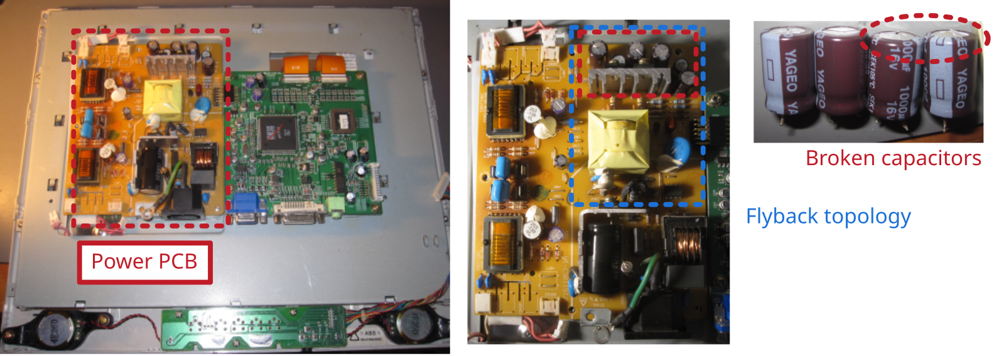

# Fujitsu Siemens LCD Color Monitor P15-1

Manufacturer: `Fujitsu Siemens Computers`     
Model: `P15-1`, `S26361-K902-V150`     
Rev: `02 G4/S6`     

## Description of failure
Does not turn on. Green power LED shows some flickering.

## Failure investigation
When checking the power supply, a flyback topology, the output capacitors seem to be blown up. In this case, it can be clearly seen that two of four electrolytic capacitors are damaged. It is always recommended to replace all capacitors, as it typically not visible if a capacitor is damaged or not. 

Nominal capacitance is `1000 µF` at `16 V`. The two blown up capacitors show `550 µF` and `775 µF` by using a simple multimeter to check for the capacitance. The others show good values, but should be replaced anyway as mentioned above. Make sure to use `105 °C` components while replacing.

## Capacitor investigation
Some theoretical background about broken electrolytic capacitors can be found [here](../../tutorials/capacitors/readme.md).

