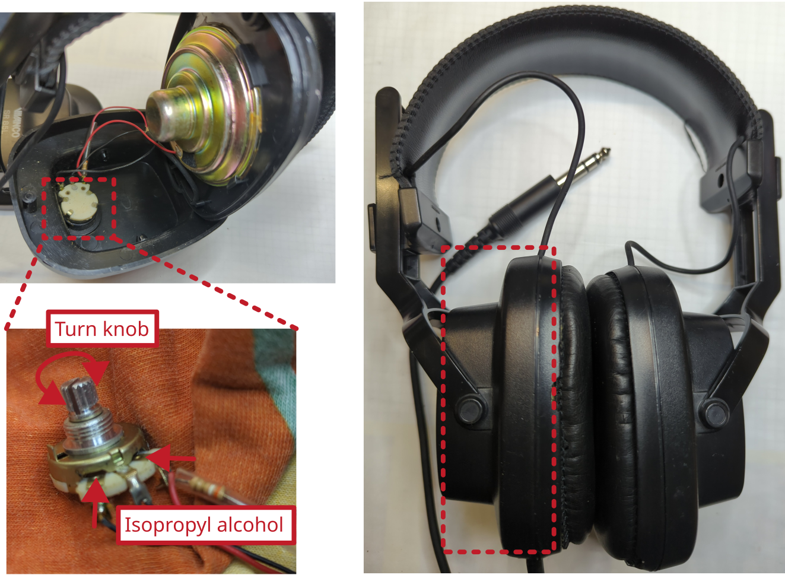

# Headphone VIVANCO SR85L

Manufacturer: `VIVANCO`    
Type: `SR85L`

## Description of failure
Left earphone: Audio output, but very noisy. Right earbud: No signal.

## Failure investigation
The fault description sounds typical for dirty potentiometers.  To clean them, isopropanol is sprayed into an opening of the potentiometer and then the potentiometer is moved around generously. This softens the dirt on the running surface of the potentiometer and pushes it away so that contact is made again. The better option is to completely disassemble the potentiometer and clean it from the inside. But be careful, sometimes it is quite difficult to reassemble them. 
