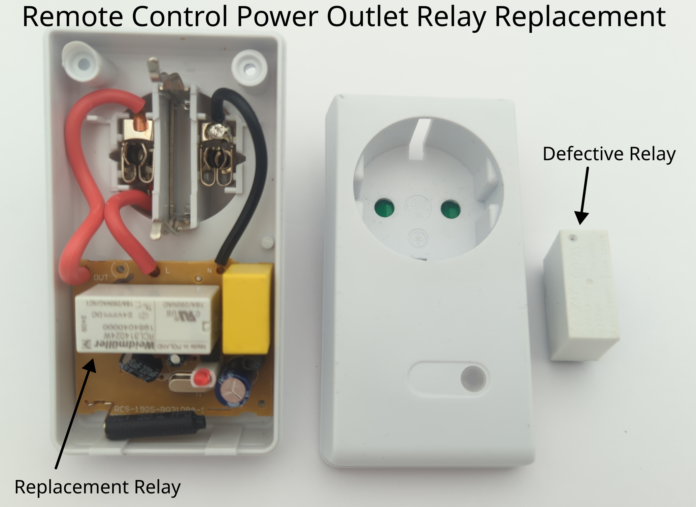

# Remote control power outlet

Manufacturer: `mumbi`    
Type: `RCS-19GS`

## Description of failure
When the remote control is pressed, the socket clicks as a result of the switching process. 
However, the load remains permanently switched on. 
It is not possible to switch it off.

## Failure investigation
Since the clicking sound is coming from the relay, this means that its triggering mechanism is working. 
This means that the contacts in the relay itself are most probably stuck together.
The relay (`24 V`, `16 A`) is replaced, and now the load can be switched off again.

Relay Reichelt order number `RCL 314024 W` 
