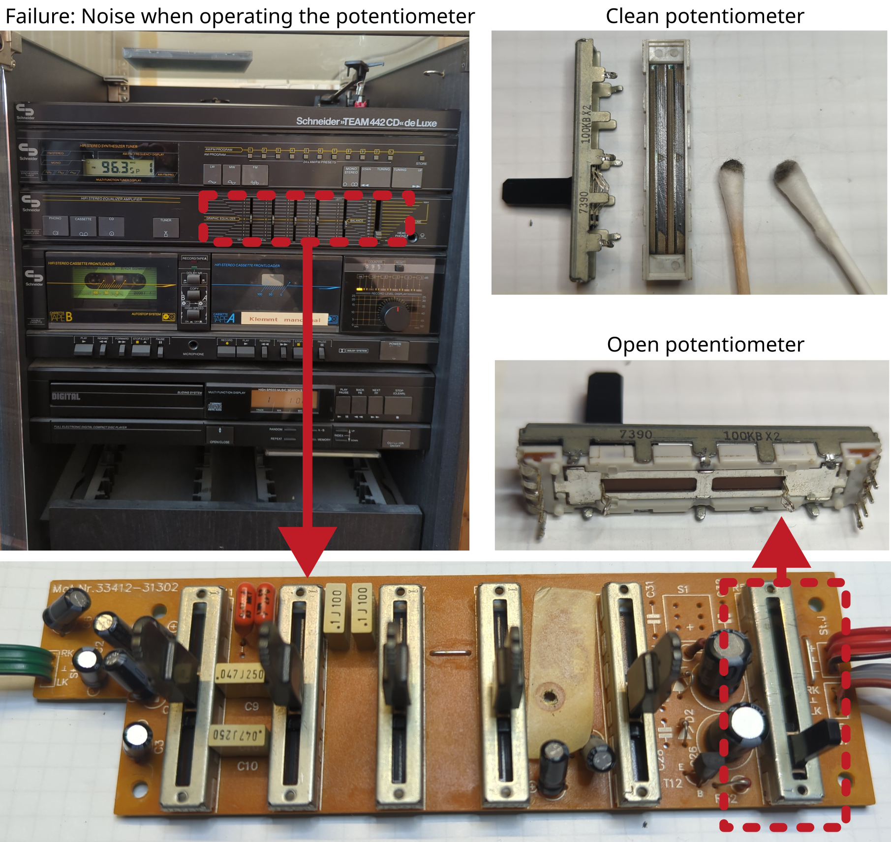

# Stereo system Schneider TEAM 442 CD deLuxe

Manufacturer: `Schneider`    
Type: `TEAM 442 CD deLuxe`    

## Description of failure
The speakers are very scratchy when adjusting the volume. 
Sometimes only the left or right speaker works.

## Failure investigation
Since the problem is definitely related to the position or movement of the potentiometer, the cause must be located here. 
This could be the potentiometer itself or its solder connections. 
However, the solder connections are visually perfect. 
The potentiometer should therefore now be replaced.

Potentiometer manufacturer: `ALPS`    
Potentiometer type: `100kBX2`    
Dimensions: `9 mm x 45 mm x 7.5 mm`    
Routh length: `30 mm`

Unfortunately, this is no longer available commercially or on the Internet. 
A suitable replacement type (dimensions / pinout) could not be found either. 
The potentiometer should therefore be cleaned thoroughly. 
To do this, it is necessary to desolder it and open it carefully with pliers. 
The track can then be cleaned with a cotton bud soaked in isopropanol. 
The contamination is clearly visible in the pictures. 
After cleaning and reassembly, the sound can be regulated again without cracking and there is no more channel failure.
