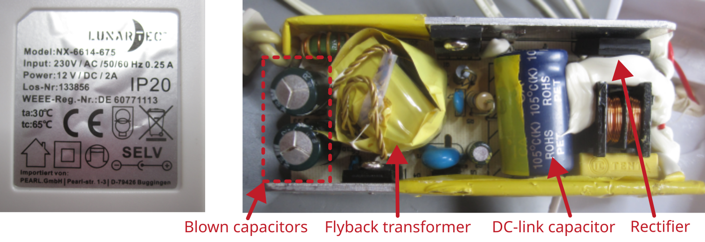

# Power Supply 12 V, 2 A

Manufacturer: `LUNARTEC`    
Type: `NX-6614-675`    
Power: `12 V,  2 A`

## Description of failure
The connected LED flickers.

## Failure investigation
In this power supply unit, the blown capacitor is immediately noticeable. Replace it and the power supply unit will work again.

How to recognize defective capacitors and replace them with a suitable capacitor can be found here: [Capacitor tutorial](../../tutorials/capacitors/readme.md)