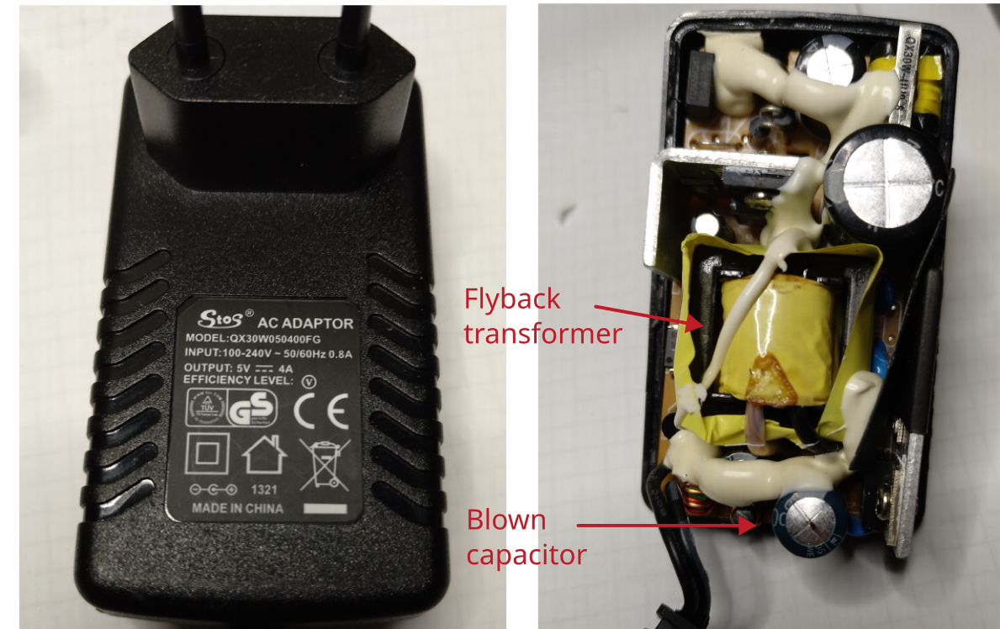

# Switch mode power supply 5V 4A

Manufacturer: `Stos`    
Model No. `QX30W050400FG`

## Description of failure
No output voltage.

## Failure investigation
In this power supply unit, the blown capacitor is immediately noticeable. Replace it and the power supply unit will work again.

How to recognize defective capacitors and replace them with a suitable capacitor can be found here: [Capacitor tutorial](../../tutorials/capacitors/readme.md)

Capacitor data:     
`2200 uF`, `10 V`, `105 °C`, diameter: `10 mm`, height: `21 mm`, RM: `5.08 mm`