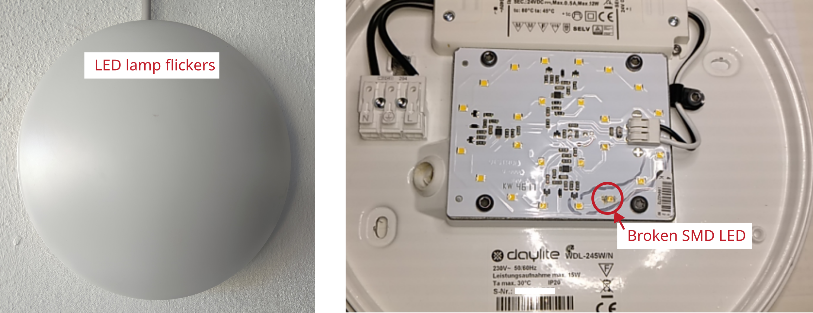

# LED Lamp Daylite flickers during operation

Manufacturer: `Daylite`    
Type: `WDL-245W/N`    
Power: `15 W` 

## Description of failure
The lamp flickers sporadically during operation.

## Failure investigation
Inside the lamp are several LED strings, each with its own LED driver. 
Only one string is affected, in which one LED is visibly damaged. 
As there was currently no spare part within reach, a pragmatic solution was found and one LED of the affected string was desoldered so that an entire string is deactivated. 
With the diffuser screwed on, there is hardly any noticeable difference from the outside. 
Five LED-strings are still lit. 
