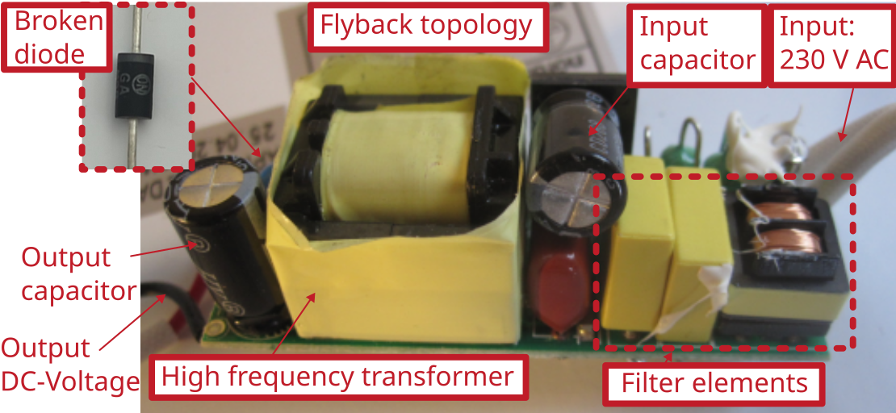

# Nordlux LED switched mode power supply repair

Manufacturer: `Nordlux`

# Description of failure
The lamp does not turn on.

# Failure investigation 
First check whether the integrated power supply unit provides an output voltage. If this is zero or unstable, this indicates a faulty power supply unit. 

## Output voltage of zero

If the power supply unit does not supply an output voltage, the semiconductors (MOSFETs, diodes) of the power supply unit should be checked. In this case, the output diode of the flyback is defective. Information on diodes and their replacement can be found in the [section on diodes](../../tutorials/diodes/readme.md). 

Original diode: `HER303, 200V, 3A`.    
Replacement diode: `BY500-1000 1000V 5A` (Pollin order number: `140716`). 

It should also be mentioned that the original diode installed is a rectifier diode for mains applications (50 Hz / 60 Hz). However, a consumer switching power supply (with silicon semiconductors) usually has switching frequencies in the range 50 kHz to 150 kHz. For this reason, a different diode was chosen as a replacement.

## Instable output voltage
If the power supply unit delivers an unstable output voltage, this usually indicates the output capacitor. You can find out how to recognize defective capacitors in the [section on electrolytic capacitors](../../tutorials/capacitors/readme.md). In very rare cases, the input capacitor is also the problem.
