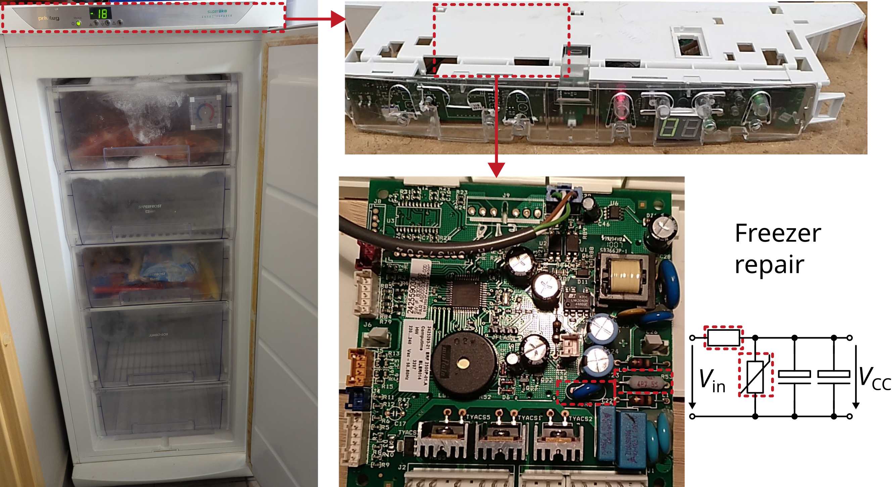

# Freezer Privileg supply board repair

Manufacturer: `Privileg`    
Type: `superöko Energiesparer`

## Description of failure
The appliance switched off during operation.

## Failure investigation
As no more lights are illuminated, the supply voltage is checked first. 
The voltage is traced from the socket to the supply board. 
It is noticeable that there is supply voltage `Vin` at the plugs to the board, but no longer at the electrolytic capacitors `Vcc` directly at the start of the board. 
The entire voltage drops across the resistor of the protection circuit because the varistor has been triggered and is now stuck at 0V. 
The two elements of the protective circuit are replaced. Now the device works again!

Due to the increased power that the resistor receives in the event of a fault, a fuse resistor should be used here. 
This safely interrupts the current flow in the event of overtemperature of the resistor.

Mouser order number for the fuse resistor:     
Resistor: `603-CRF200JT524R7UL`

Reichelt order numbers:      
Varistor: `EPC B72210-S 27`