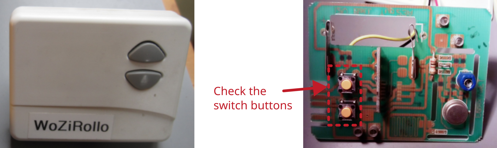

# Roller blind control

Manufacturer: `CHAMBERLAIN`     
Type: `Funkwandschalter TCTX2ED`     

## Description of failure
This roller blind control system raises or lowers an electric roller blind at the touch of a button. However, several button presses are required to raise or lower the blind until the button press is recognized.

## Failure investigation
The given phenomena are often due to weak batteries (battery has already been removed in the picture) or defective switches. The battery is therefore checked first, but the voltage is still almost the same as that of a new battery. For this reason, the buttons are now examined more closely (but the battery is removed from the system first):
Desolder the buttons. Use a multimeter to check the resistance when the button is pressed and open. When the button is open, the multimeter should show a high resistance outside the measuring range. Now measure the resistance when the button is pressed. This ranges between 25...160 ohms with the button in place, only very rarely is it significantly <1 ohm, as it should be. This also explains the many attempts until the roller blind actually reacts. The other button is also measured and replaced.

The roller blind now works perfectly again.

Note: If only one button is defective, it is still advisable to replace both buttons, as it usually doesn't take long for the other one to break.
