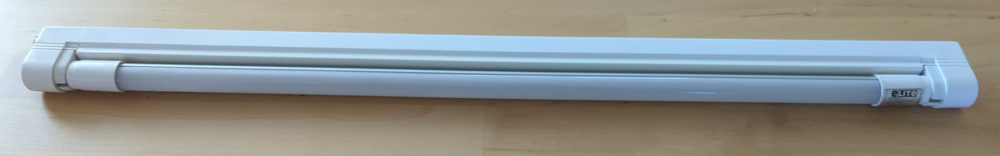
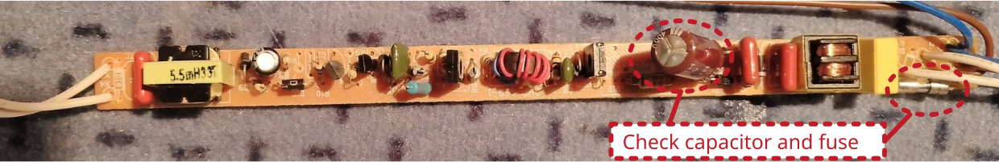
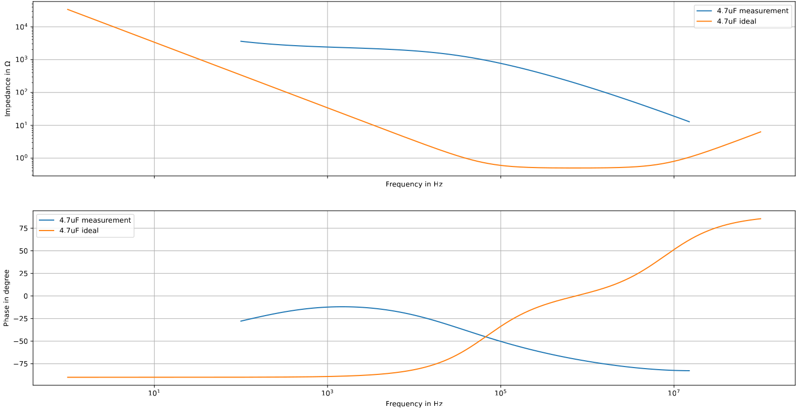

# Self-ballasted lamp

## Description of failure
The lamp does not turn on.

## Troubleshooting

From the PCB it can be clearly seen that the electrolytic capacitor is blown up. To replace the capacitor, use a `105°C 400V 4.7µF` component. See also the [capacitor section](../../tutorials/capacitors/readme.md). Due to the blown-up capacitor, the fuse has also blown up. The fuse type is `1 A,  250 V`.

In this case, the lighting body itself (`Osram 13W L 13/640`) is also broken. When replacing it, think about an LED replacement instead of a self-ballasted lamp replacement. Note that most LED replacements for `T5`-lamps also need the ballast unit to limit the current.

## Capacitor investigation
The capacitor is measured by an impedance analyzer. For comparison, a healthy electrolytic capacitor is added to the diagram. It can be clearly seen, that the impedance behavior of the measured on is undefined. How to read an impedance plot is also described in the [capacitor section](../../tutorials/capacitors/readme.md).

