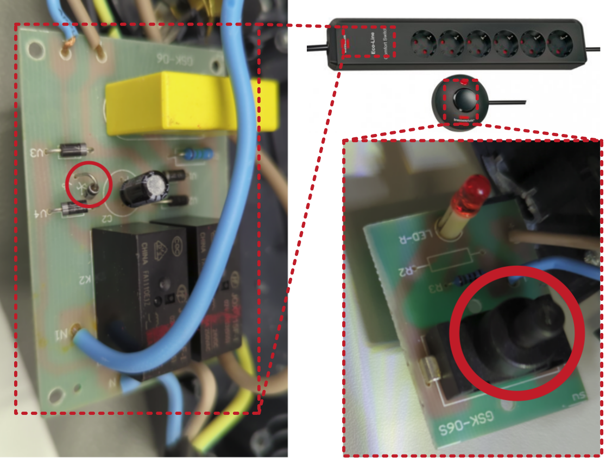

# Switchable socket strip Brennenstuhl Eco-Line Comfort Switch

## Description of failure
The switchable socket strip can no longer be switched after about one year operation. 

## Troubleshooting
As can be seen in the circuit diagram, the freewheeling diode and the switch are defective. Replacing both components solves the problem.

## Detailed view of the error

From the logic, the free-wheeling diode of the two relays must have broken first. Due to the malfunctioning diode, the stored energy in the relay then had to flow via the mains diodes and then via the switch. This inductive load destroyed the switch (switch is welded together).

Important note: By switching the load via a relay, the circuit is completely separated from the load circuit. The defect of the components therefore indicates a too weakly dimensioned free-wheeling diode. It is important to replace the diode afterwards by one with higher current carrying capacity.
