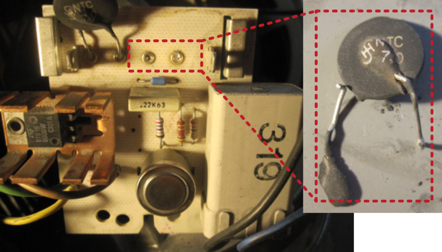
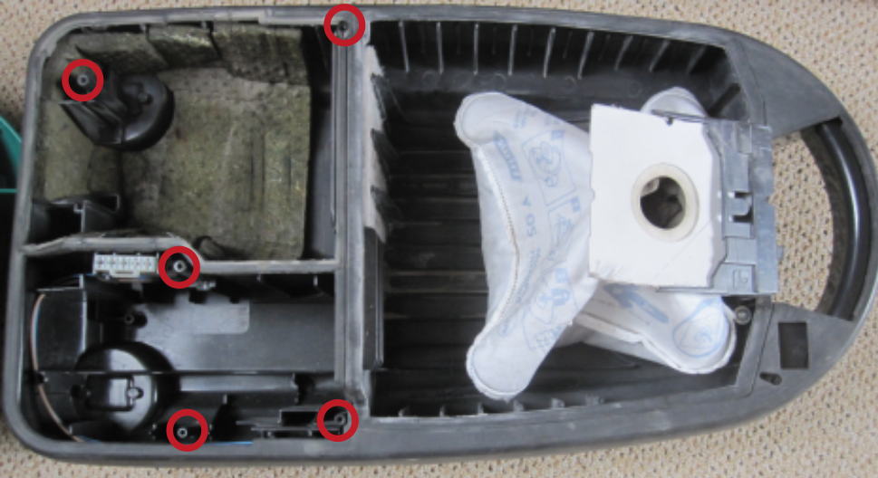

# Vacuum cleaner Miele

Miele Electronic S4241

## Description of failure
Does not turn on.

## Troubleshooting
When having a closer look at the power PCB, it can be seen that one thermistor is missing. This device has desoldered itself. After replacing this device, the vacuum cleaner works fine!

## Schematic investigation
To limit the motors inrush-current, two `7 Ohm` NTC-thermistors `TH1` and `TH2` (negative temperature coefficient) are placed in series. After the triac `D2` has turned on, the current would be too high without any current limiting elements. The thermistors limit the current, while producing heat. Due to the negative temperature coefficient, the resistance gets lower after a short time while the temperature rises. So, the motor can operate with full-power, after the final motor speed is reached. Thermistor `EPCOS/TDK` order number `B57237S0709M000`.

Some additional comments to the schematic:
 * `C1` works as an `X`-capacitor, `C2` and `C3` work as `Y`-capacitors for EMC filtering.
 * Once the motor `M1` blocks or a too high current flows trough the motor, a significant voltage drop accours over `L1` so that the `warning`-lamp turns on.
 * to turn on the triac `D2`, a diac `D1` together with the capacitor `C4` is used to provide the necessary current to fire the triac `D2`.
 * The potentiometer `R1` represents the slider to control the vacuum cleaners power.

## Motor failure
Another common fault in vacuum cleaners is the motor itself. Replacement motors can often be purchased from the manufacturer or on ebay.

## Open the housing
May this figure helps to detect screw holes to open the housing.

