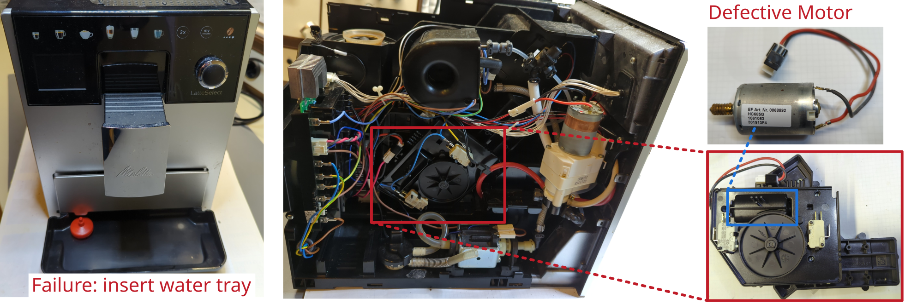

# Coffee maker Melitta

Manufacturer: `Melitta Latte Select`     
Type: `F63/0-201`

## Description of failure
The machine starts, but does not operate. The displayed failure is `water tray missing`, even the water tray is assembled.

## Failure investigation
First, the coffee machine is opened and the switch for detecting the water tray is measured. However, this shows perfect behavior (low on-resistance, high resistance in open state. Even after several attempts). The water tray switch is connected in series with the drive unit. This means that there appears to be an interruption in the electrical connection, otherwise the fault would have nothing to do with the water tray. 

The motor unit is removed and disassembled. It can now be seen that the two connection cables go directly to the motor and that there are no electronics in between. The motor can therefore be measured. A simple resistance measurement at the motor terminals is sufficient: high resistance and therefore the winding is probably burnt out. This means that no current can flow through the universal motor and it cannot start.

The drive unit is available [to buy](https://komtra.de/melitta-ersatzteile/melitta-ersatzteile/antrieb-getriebe-kpl.-melitta-kaffeevollautomaten1.html) as an entire assembly and can be easily replaced. After replacement, the coffee machine works perfectly again.

Note, there are nice tutorials how to replace components for coffee makers at [https://komtra.de](https://komtra.de)