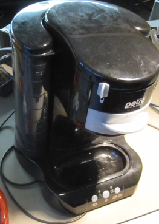

# Coffee maker Petra KN 31 17

## Description of failure
When brewing a coffee, the machine turns-off during the heating phase. 

## Troubleshooting

The machine has a so-called capacitor power supply. This is without potential isolation and simply constructed by a reactance (capacitor). If the capacitor loses capacity, the impedance is increased. In the heating process, where a lot of current is taken, too much voltage drops across the capacitor, so that there is not enough voltage left for the heating. The undervoltage causes the machine to switch off.

While writing this section, i found out that there is another [nice tutorial](https://de.ifixit.com/Anleitung/Petra+KN+31+17+Kondensatorentausch/42978) available. 

## Impedance of the capacitors
Measuring the capacitors with the impedance analyzer shows a significantly lower capacitance of the `680 µF` capacitor. This can be seen in the higher impedance of the measurement (solid brown line) compared to the calculated curve (dashed brown line, labeled as `ideal`). For information, the other capacitors (measurement and calculation) are also shown in the diagram.

