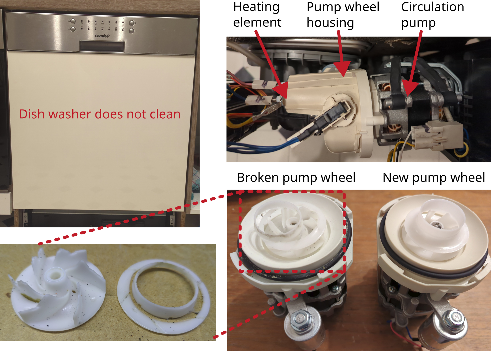

# Dishwasher Comfee 

Manufacturer: `Comfee`    
Type: `CGT 60 EAA`

## Description of failure
The dishes in the dishwasher no longer get properly clean. 
Some of the dishes still have food left on them.
The machine also makes a very loud humming noise during the wash cycle.

## Failure investigation
If the dishes do not get properly clean, the following should be checked:
* Are the filters clogged?
* Is the machine heating? (only then can the detergent work properly)
* Is the water being pumped well?

The filters have been checked (not clogged) and cleaned. The dishes are very warm at the end of the wash cycle, so the heating resistor is OK. This leaves a check of the heating and circulation pump, which is a single component. This pump is also responsible for the described humming noise during the wash cycle. However, this pump must generally still be working, as it also transports the water through the machine and has obviously been washed, just not very thoroughly.

The pump is removed and checked electrically. The auxiliary capacitor has the specified capacity when measured, and the winding resistances of the motor also give no indication of an electrical defect. The cover for the pump wheel is now removed. This is visibly damaged. The part can be purchased separately online, but a new pump may have to be purchased.

Pump: `YXW50-2E`

After installing the new pump, it is essential to carry out a test run with the side wall open to check whether the pump is leak-proof.
In this case, there was a leak from the seal of the water pressure switch. The part with the pump housing therefore also had to be replaced.