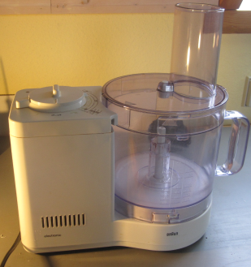

# Food processor BRAUN 4262

Manufacturer: `BRAUN`    
Type: `4262`

## Description of failure
The machine has a short-time mode (by push-button) and a continuous mode (by switch). Continuous operation no longer works. 

## Failure investigation
As the push-button operation continues to function, it is clear that the electronics and the motor are still working. The switch should therefore be examined first. After removing the circuit board, measurements can be taken directly at the switch connections. It can already be determined that there is no contact in the switch position of continuous operation. 

As the switch cannot be ordered new, it is opened and inspected. The burnt contact is clearly visible. A simple re-bending and cleaning of the contact surfaces with isopropyl alcohol gives the machine a new lease of life. Make sure that the distance between the metal and its contact point is the same as for the switch that is still intact (on the other side).

Other users have also reported [this problem](https://howtomendit.com/answers.php?id=293076).