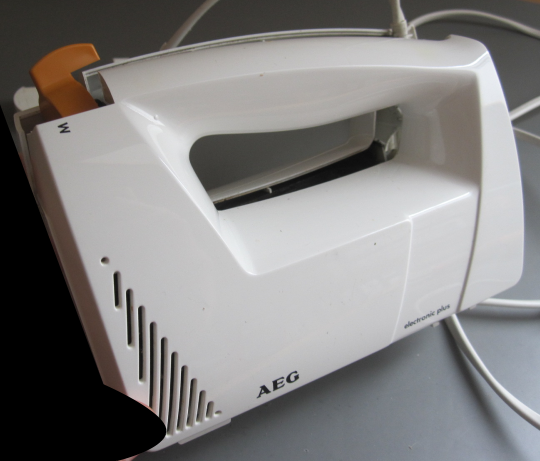
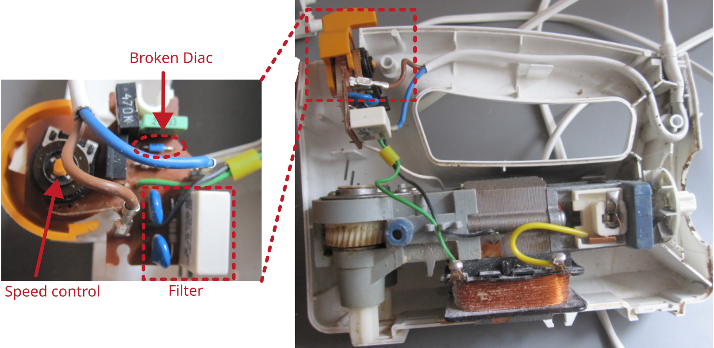

# Kitchen blender AEG

Manufacturer: `AEG`    
Type: `HM 197 sel, E EM 0034`     
E-Number: `613619030`    
Mains: `230 V`, `190 W`, `50 Hz`

## Description of failure
The blender has run out of power.

## Schematic investigation
The following diagram shows the self-drawn circuit diagram of the mixer. The speed is controlled by phase control via the triac T1. To fire the triac T1, the capacitor C4 is charged via the resistors until the diac reaches its firing voltage. This results in a high current which is sufficient to fire the triac. 

Setting the idle speed: `R2` (performed by the manufacturer)    
Set the operating speed: `R3` (Set by the user)    
Filter elements: `R1`, `C1`, `C2`, `C3`    
Triac: `T1`    
Auxiliary circuit to fire the triac: `T2` (Diac), `R4`, `C4`

## Failure investigation
The potentiometers are tested separately. The triac is also obviously not short-circuited, as otherwise the device would turn at full speed continuously. This leaves mainly the diac. This is checked below.

A separate test circuit is set up to check the diac individually. As a diac usually becomes conductive when a certain voltage is reached, a voltage is applied via a series resistor and a variable voltage source. The voltage of the diac is measured (see picture). 

According to the data sheet, the Diac DB3 should have a breakdown voltage of `28-36 V` before it fires (voltage drops by approx. `5 V`). However, the voltage at the diac is permanently at `22 V` without an increased voltage being present beforehand. This indicates a defect in the component. 

Diac `DB3` Conrad order number: `186406`. 