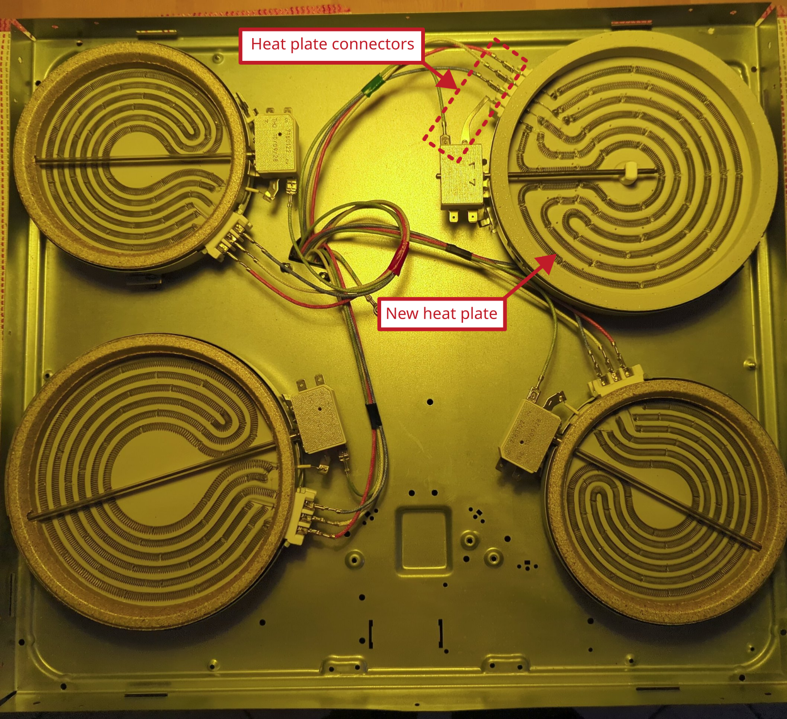

# Stove Beko: broken heat plate

Model: BEKO EH 9610 XHN

## Description of failure
One hot plate does not work with full-power, as can be seen in the figure.

## Troubleshooting

First determine whether the switch or the heating plate is the problem (since switches also often break). To do this, swap the cable connection of the two heating plates `of the same size` with the switches and check whether the heating plate provides full power. If the heating plate is working, the switch is defective, otherwise the heating plate is defective. In this case, the heating plate is defective and is replaced. It is a `1700 W` heat plate. After replacing the heating plate, the oven works correctly again.

