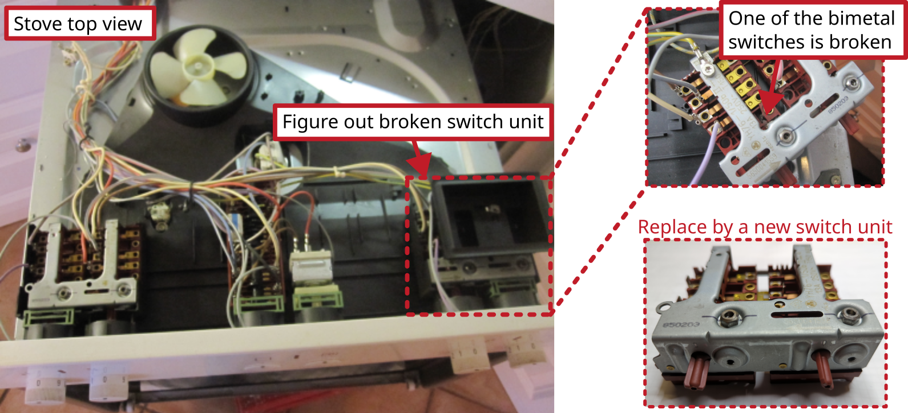

# Stove Siemens HE204221 / 01: Heatplate always runs on full-power

Model: Siemens HE204221 / 01

## Description of failure
One hot plate does runs on full-power, once the hot plate is turned on. The power of the plate can no longer be regulated. 

## Troubleshooting
Obviously the hotplate is working perfectly. Then the switching unit, which no longer switches off, comes under investigation. 

A hot plate switch has an integrated bimetal that heats up depending on the current flow. If this becomes too hot, the bimetal switch switches itself off. The bimetal is pre-tensioned accordingly by the rotary control on the hotplate so that different temperatures can be set on the hotplate. In this case, the bimetal is bonded. The switch unit is completely replaced and the hotplate control works perfectly again.
