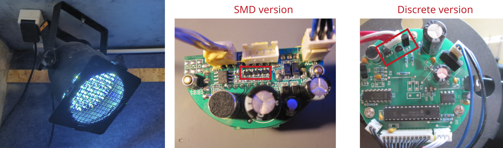
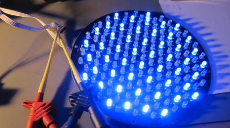

# LED headlights: Stairville LED PAR 56

Manufacturer: `Stairville`     
Type: `LED PAR 56`

## Description of failure
The blue LEDs fail completely or flicker.

## Failure investigation

First, the LEDs are disconnected and operated directly from a voltage source. There, all LEDs run for hours without failure or flickering. This means that the fault is on the control board. The current consumption of the individual colors is as follows:

current red total: `137 mA`    
current green total: `180 mA`     
current blue total: `200 mA`

LEDs are usually dimmed via PWM. The corresponding transistors are searched for on the circuit board for this purpose. The drain-source voltages of the individual transistors are measured at 100% duty cycle. 

transistor drain-source voltage red: `0.2 V`    
transistor drain-source voltage green: `0.3 V`   
transistor drain-source voltage blue: `1.9 V ... 2.9 V`

The much too high voltage across the transistor for the color blue is clearly visible. As this transistor is loaded more than the others due to the higher current consumption, it has broken down over time. It must be replaced. There are at least two versions of the assembly, an SMD version and a discrete version:

Reichelt odering number SMD version: `BC 817-40 SMD`

It is also advisable to replace all three transistors at the same time. 