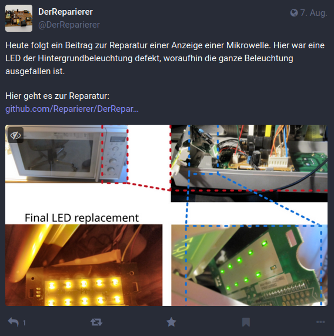

# Welcome! All about repairing electronics.

Electrical devices are thrown away far too often, even though only a small thing is defective. 
In most cases, it is uneconomical to have the device professionally repaired. 
Nevertheless, many people are unwilling to throw away devices, most of which are not yet old. 
This repository is intended to collect repair tips that contribute to successful device repair.

## How to use this repository
This repository is a collection of repair manuals for (mainly) electronic devices.
There are multiple ways to view the content:
 * [Codeberg repository](https://codeberg.org/derReparierer/derReparierer): Search the repository manually to view the tutorials (readme files in the subdirectories) 
 * [Website](https://derreparierer.codeberg.page/derreparierer/) (automatically generated from the repository)

## DerReparierer on [Mastodon](https://social.tchncs.de/@derreparierer)

DerReparierer can also be found on [Mastodon](https://social.tchncs.de/@derreparierer). 
Here you can find the latest repairs as well as information about upcoming events of Repair Cafes.

## Contributing
If you have repaired an electronic device whose troubleshooting should be documented, create an article (`readme.md`) in a corresponding subfolder.
 * focus should be on electronics
 * folder should contain a `readme` file, and `figures` subdirectory
 * article should contain some information about the device (e.g. `Manufacturer` and `Type`)
 * article should contain a section `Description of failure`
 * article should contain a section `Failure investigation`
 * open a pull request on [Codeberg](https://codeberg.org/derReparierer/derReparierer)

## License
This work is licensed under [CC BY-SA 4.0](https://creativecommons.org/licenses/by-sa/4.0/).
