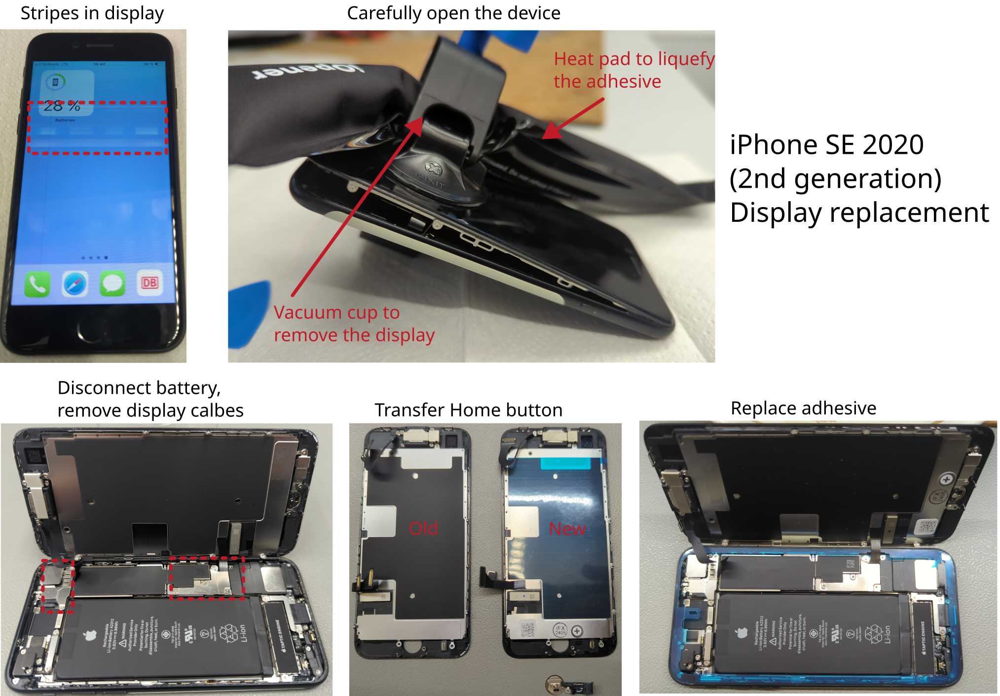

# Display replacement iPhone SE 2020

Manufacturer: `Apple`    
Type: `iPhone SE 2020 (2nd)`

## Description of failure
The display has very visible unwanted stripes.

## Display replacement
The display replacement is based on the [instructions from iFixIt](https://www.ifixit.com/Guide/iPhone+SE+2020+Screen+Replacement/133817).
The linked instructions are of high quality and contain many useful tips and tricks. 
Read them carefully before you start. 
Special tools are required, especially for the housing screws. 
The tools for opening are optional, but increase the success of the repair. 

Before final assembly with a new seal, the device should be checked for function:
 - Tighten the home button and mount the display
 - Switch on the device to test the display. Try out the touch screen and different brightness levels
 - Check the feel of the home button. If it does not react as usual, loosen the screw slightly. This screw is generally very loose compared to the others.
 - Switch the device off again and continue with the assembly.

Do not forget to replace the adhesive. This is shown in this [iFixIt instruction](https://www.ifixit.com/Guide/iPhone+Display+Adhesive+Replacement/93983).