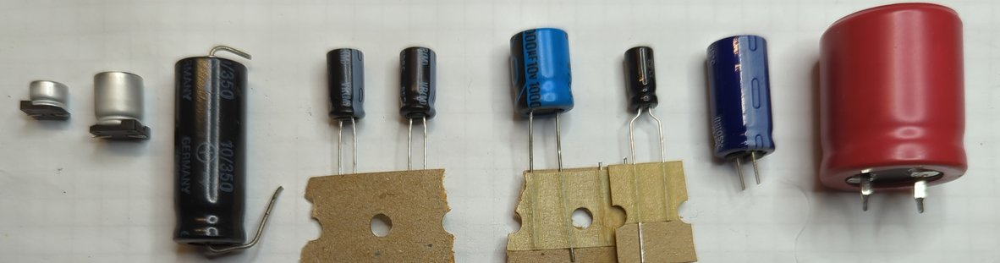
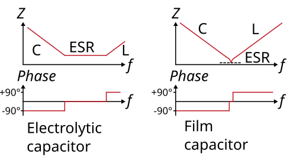
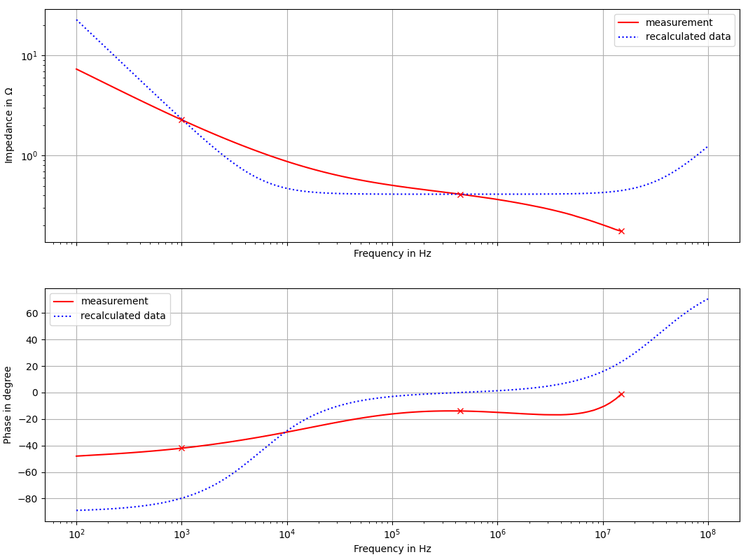

# Capacitors
Capacitors are one of the most important components when it comes to smoothing the output voltage of power supplies. This section gives a rough overview of the most common defects of the components.

## Electrolitic capacitors

Switching power supplies are nowadays the standard to provide stable voltage supplies for other electronics (TV, monitor, ...). To work most efficiently, they use switched, mostly triangular current waveforms in the conversion from one voltage form to another (e.g. from 230 V AC to 12 V DC). To ensure that the output voltage is largely free of ripples, very high capacitances are required to smooth them out. In order to realize very high capacitances in a very small space, electrolytic capacitors are used. Compared to other technologies (ceramic capacitors, film capacitors), these have a very high capacitance with a small volume. In order to provide this high capacitance, however, it is necessary to build the capacitor with a dielectric with a high dielectric constant. This is the liquid electrolyte. Due to the liquid property, it is possible for the electrolyte to escape over time, among other things. The self-heating of the capacitor contributes somewhat to the escape of the electrolyte, which in turn is caused by the ripple current to be smoothed.

The figure below shows an equivalent circuit of an electrolytic capacitor. The capacitance is abstracted by `C`, the eqivalent series resistance (ESR) as well as the internal inductance `L` (made by terminal connections and internal film) are shown. The values of `ESR` and `L` are very very small, compared to `C` for DC.

Definitely defective electrolytic capacitors can be recognized by a curved case cover. __Unfortunately, this is not always the case.__ Often the components are not visible from the outside. A good indication of a defective capacitor is an unstable voltage when you measure the voltage with a multimeter. What helps for sure is desoldering and measuring. The capacitance should be checked, which can be done with a simple multimeter. The deviation as printed on the capacitor, taking into account the also printed tolerance. If possible, the equivalent series resistance (ESR) of the capacitor should also be measured. However, this requires a special measuring device (ESR meter). Since the ESR is usually not included in the data sheets of the components and this is strongly dependent on the installed series, it is difficult to give a guideline value here. Definitely the resistance should be smaller than `0.5 Ohm`. The ESR can not be measured with a conventional multimeter!

In general, it makes sense to replace the electrolytic capacitors on suspicion. This applies in particular to the capacitors which have to smooth a high ripple current, i.e. low-voltage capacitors (imprint up to '50 V'), which are usually located behind an RF transformer and a diode. The electrolytic capacitors on the input side of the switching power supply are often not affected (imprint usually about `380 V`). Since the device to be repaired is usually already a few years old, as well as that the capacitors are available very cheaply, it makes sense to replace them as soon as the device is open anyway. 

When replacing capacitors, make sure that the printed voltage class is at least the same. Furthermore, it is recommended to always select the temperature class '105 °C' for the replacement, even if the defective capacitor has a lower temperature class. Furthermore, attention should be paid to the construction volume (will the replacement capacitor fit into the given space?) as well as the grid dimension (pin spacing). The capacitance should of course be selected to be equal or greater.

## Film capacitors

Film capacitors are often used in so-called [capacitor power supplies](https://en.wikipedia.org/wiki/Capacitive_power_supply). Here, the capacitor serves as a reactance to reduce the voltage. In most cases, capacitor power supplies are used as a low-cost alternative to switching power supplies. The voltage drop across the capacitor is `U = 2 * pi * f * C`, with almost no power dissipation in the capacitor due to the almost ideal `90 °` phase shift. Capacitors in capacitor power supplies often lose capacitance over time, so that the reactance increases over time. Due to the increased resistance, it can then happen after some time that the output voltage of the power supply becomes too low. The capacitance of the capacitor can be determined with a conventional multimeter.

Since the capacitors are directly exposed to the mains voltage, and thus also to switching transients, they must belong to a higher safety class than conventional film capacitors. The safety class defines the level of pulse resistance and non-flammability. Mostly this is the safety class `X2` used in capacitor power supplies. In addition to capacitance, voltage, dimensions and pitch, this must be taken into account when replacing the capacitor. 

Note that in the figure above, the first capacitor is no safety capacitor, as the `X2` label is missing. This component should not be used when connecting direct to the mains, as it is done in capacitor power supplies. All other capacitors are marked by an `X2` label.

## Investigating in impedance plots

Another way to investigate components is to measure them with an impedance analyzer. This shows the impedance and phase of the component over the frequency in a double logarithmic scale. 

Typical curves for electrolytic capacitor and film capacitor are shown here. At low frequencies mainly the capacitance C acts, at high frequencies mainly the inductance L. For electrolytic capacitors the ESR is very large compared to the film capacitor. This is reflected in the plateau of the curve. 

Defective capacitors can be recognized by the fact that they are 
 * deviate strongly in terms of capacitance
 * deviate strongly from the ESR
 * the curve no longer has the typical curve shape.

The following figure shows an good `1000 µF` electrolytic capacitor (which was recalculated, in dashed line) and a broken electrolytic capacitor. It can be clearly seen, that the measured waveform of the broken capacitor strongly derivates from the calculated good waveform.

Another example is given for several film capacitors. All curves show different values of capacitance and all curve waveforms look like a typical shape for a film capacitor. For the `680 nF` (brown line), the real capacitance curve is shown by the dashed line. The derivation in capacitance is high, so the capacitor has lost its capacitance.

