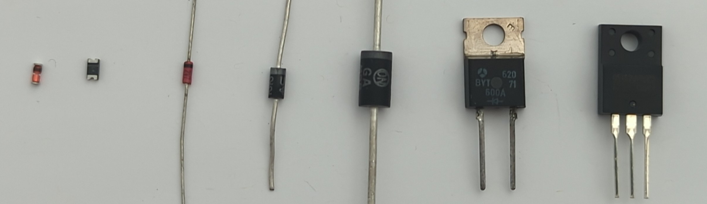
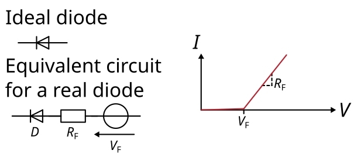

# Diodes in switched-mode power supplies (SMPS)

In this section we look at the function and error mechanisms of diodes. Diodes are essential in modern switching power supplies. They rectify an alternating voltage. In general, there are many different types of diodes, e.g. PN diodes, Schottky diodes, Zener diodes, SiC diodes and many more. As PN and Schottky diodes are most commonly found in switching power supplies, we will focus on these in this article.

The equivalent circuit of a real diode contains a voltage source `V_F` which represents the forward voltage, a resistor `R_F` which represents the resistance of the diodes channel and an ideal diode `D` which represents the conducting behaviour for current, which is only allowed in one direction. All together, with this equivalent circuit, the diodes forward characteristic can be modeled in the `UI`-diagram.

## Diode failures
Diodes often break as a short circuit. In rare cases, they are also completely high-impedance. The easiest way to detect defective diodes is to check the forward voltage `V_F` with a multimeter. Depending on the diode technology, this should be in the range of `0.2 V` to `0.8 V`. However, if the multimeter shows a forward voltage of `0V`, the diode is defective.

## Replacing diodes
If possible, broken diodes should be replaced with the same type. This is where the least can go wrong. If this is not possible, attention should be paid to the following properties:
* The blocking voltage of the new diode should be the same as that of the old diode. A higher blocking voltage is not always recommended, as a higher blocking voltage usually also increases the on-state resistance.
 * The maximum current should be greater than or equal to the old diode
 * The housing and the pinout should be the same.
 * Another important replacement information is the switching frequency, the diode will be used for. There are special diodes for `50 Hz`-rectifiers, as well as ultra-fast diodes for switched-mode power supplies, e.g. with switching frequencies in the range of `50 kHz` to `200 kHz`. Make sure that you find out the purpose of the diode, what it is used for.