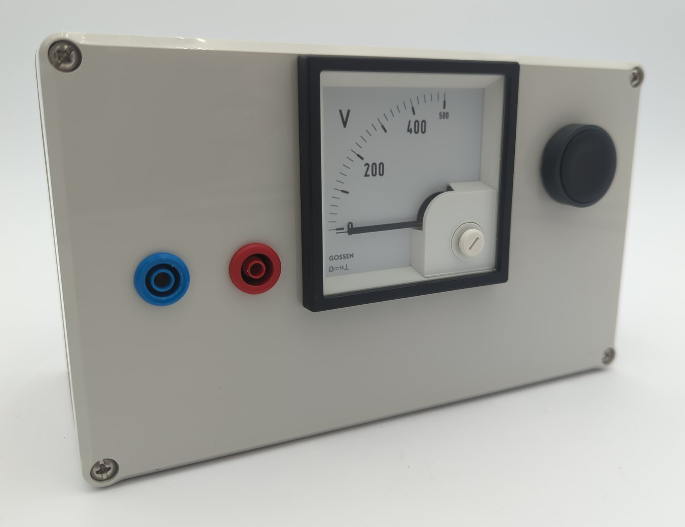

# Discharging box 

## Introduction 
Single-phase switching power supplies usually have a DC link capacitor that is charged to 325 V (diode rectifier) or approx. 380 V (circuits with power factor correction), depending on the design. 
Before starting repairs, you must ensure that this capacitor is discharged. 
In most cases, the capacitor discharges after the power plug is pulled due to the energy requirements of the downstream electronics or due to a discharge resistor. 
In defective devices, however, the capacitor may not discharge when the power plug is pulled. 
This is why this discharge box is presented. 

The discharge box has an internal resistor that can be connected in parallel to it via a button to discharge the DC link. 
The analog voltage display continuously measures the DC link voltage. 
Unlike many digital multimeters, it does not switch off after a certain period of time.

## Usage and internal structure
The discharge box is attached to the DC link capacitor accordingly. 
However, it is often difficult to access, so depending on the design, you have to find other points with the same potential. 
The analog multimeter continuously measures the voltage. 
If the capacitor does not discharge itself after being disconnected from the mains, the resistor can be switched on using the button. 
Repairs can then be carried out. 
Please always observe the [five safety rules](https://de.wikipedia.org/wiki/F%C3%BCnf_Sicherheitsregeln).

The interior of the box is constructed as follows:
* Analog measuring device, so that it does not switch off after a while like a digital multimeter.
* Heavily oversized resistor: Withstands even brief accidental discharging with the mains connected. It also weighs down the box so that it does not tip over.

## Bill of materials
Reichelt
 * `ARC HS300 470R J` (Resistor, `300 W`, `470 Ohm`, `5 %`)
 * `DQB 72-500V` (Measurement unit `0 V ... 500 V`)
 * `XB5AA21` (Push button)
 * `3M SJ5012 BLACK` (Rubber feet)

Conrad
 * `1388488` (Plastic housing)
 * `735051` (`4 mm` safety plug red)
 * `735060` (`4 mm` safety plug blue)
